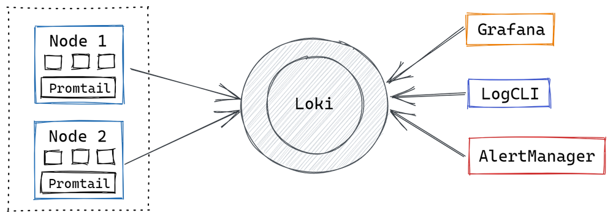
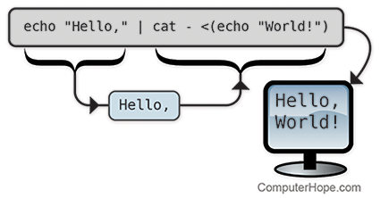

# O que é o loki

O Loki é um sistema de agregação de log inspirado no Prometheus. 

Ele foi projetado para ser muito econômico e fácil de operar comparado a outros sistemas de agregação de logs. 

O Loki indexa um conjunto de rótulos para cada fluxo de logs, em vez de indexar o contexto dos logs.

# Arquitetura

Como podemos ver na imagem acima temos alguns componentes que precisamos conhecer.

Do lado esquerdo temos o node, o node  ou nó é uma máquina de processamento físico virtual. Esse nó é equivalente a uma maquina padrão (como a sua) ou múltiplas máquinas controladas pelo control plaine do Kubernetes.

Dentro desse nó temos os containers rodando de forma atômica (de forma individual).

Quando utilizamos containers, nós temos um fluxo de Saida chamada de stdout. 

O **STDOUT** representa um monitor de saída padrão do usuário e nessa interface nós temos todas as saídas da aplicação em formato de texto. Em outras palavras o famoso println, console.log ou até mesmo o echo.

Voltando ao promtail,  ele é um coletor de log feito apenas para o loki, ele utiliza o conceito de service Discovery o mesmo que serviço do Prometheus (ele auto descobre os logs dos containers em execução) e/ou no host que esta instalado e configurado e tem a finalidade de coletar esses logs automaticamente e enviar para o Loki.

Por fim temos o grandioso Loki que serve para armazenar indexar os logs, o Loki é semelhante a
ao Elastic Search, mas de certa forma ele é mais rápido para configurar e possui os mesmos recursos.

Para exploração dos logs, nós podemos usar o logql que é a linguagem de consulta do loc e para visualizar essas consultas tem umas duas opções:
- O grafana de forma visual
- O logcli para visualizar pelo terminal