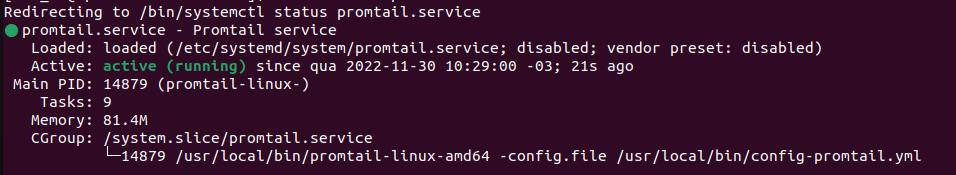

# Instalando o Promtail CentOS 7
Nesse artigo vamos criar o serviço Promtail que atuará como o coletor do Loki.

# Pré Requisitos
- Centos 7
- Permissão de Sudo
- Curl
- Unzip

# Instale o binário
- Acesse a bin com o seguinte comando:
```
cd /usr/local/bin
```

- Faça o download do binário do promtail
```
curl -O -L "https://github.com/grafana/loki/releases/download/v2.7.0/promtail-linux-amd64.zip"
```

Para verificar a versão mais recente do Promtail, visite a página de lançamentos do Loki. https://github.com/grafana/loki/releases/


- Descompacte o arquivo
```
unzip "promtail-linux-amd64.zip"
```
Note que a versão que estamos utilizando na instalação é a 2.7.0, recomendo que olhe a versão mais recente e atualize o comando.

- Atribua permissão de execução do binário
```
sudo chmod a+x "promtail-linux-amd64"
```

- Crie o arquivo de configuração do Promtail
```
sudo nano config-promtail.yml
```

E adicione este script,
```
server:
  http_listen_port: 9080
  grpc_listen_port: 0

positions:
  filename: /tmp/positions.yaml

clients:
  - url: 'http://localhost:3100/loki/api/v1/push'

scrape_configs:
  - job_name: system
    static_configs:
      - targets:
          - localhost
        labels:
          job: varlogs
          __path__: /var/log/*log
```

**IMPORTANTE:** Note que estamos direcionando o promtail para o loki na url http://localhost:3100, caso o loki esteja em outro servidor, atualize a url do cliente.

E agora podemos fechar e salvar o arquivo com os seguintes comandos

<kbd>Crlt + X</kbd> - Para informar que queremos sair da edição do arquivo

<kbd>Y/S</kbd> - Para informar que queremos salvar as alterações

<kbd>Enter</kbd> - Para confirmar o que queremos


# Configurar Promtail como um serviço
Agora vamos configurar o Promtail como um serviço para que possamos mantê-lo rodando em segundo plano.

- Criar usuário especificamente para o serviço Promtail
```
sudo useradd --system promtail
```
- Crie um arquivo chamado promtail.service
```
sudo nano /etc/systemd/system/promtail.service
```

E adicione este script,
```
[Unit]
Description=Promtail service
After=network.target

[Service]
Type=simple
User=promtail
ExecStart=/usr/local/bin/promtail-linux-amd64 -config.file /usr/local/bin/config-promtail.yml

[Install]
WantedBy=multi-user.target
```

E agora podemos fechar e salvar o arquivo com os seguintes comandos

<kbd>Crlt + X</kbd> - Para informar que queremos sair da edição do arquivo

<kbd>Y/S</kbd> - Para informar que queremos salvar as alterações

<kbd>Enter</kbd> - Para confirmar o que queremos

Agora inicie e verifique se o serviço está em execução.
```
sudo service promtail start
sudo service promtail status
```

Caso esteja tudo certo até aqui, você receberá uma imagem parecida com essa



# Atribuir permissões para o promtail ler os arquivos

- Então adicione o usuário promtail ao admgrupo

```
sudo usermod -a -G adm promtail
```

- Verifique se o usuário agora está no adm grupo
```
id promtail
```

- Reinicie o Promtail e verifique o status
```
sudo service promtail restart
sudo service promtail status
```

- Habilite o promtail para iniciar junto com a maquina
```
sudo systemctl enable promtail.service
```

# Teste!

Voce pode testar se esta tudo funcionando com o comando:

```
curl "127.0.0.1:9080/metrics"
```

Se não der nenhum erro vai retornar as métricas do promtail.