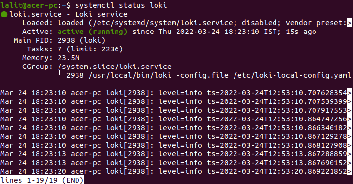

# Instalando o Loki CentOS 7
Nesse artigo vamos criar o serviço Loki que irá armazenar e expor os logs através de endpoint.

# Pré Requisitos
- Centos 7
- Permissão de Sudo
- Curl
- Unzip


# Instale o binário Loki
- Acesse a bin com o seguinte comando:
```
cd /usr/local/bin
```

- Faça o download do binário do promtail
```
curl -O -L "https://github.com/grafana/loki/releases/download/v2.7.0/loki-linux-amd64.zip"
```

Para verificar a versão mais recente do Loki, visite a página de lançamentos do Loki. https://github.com/grafana/loki/releases/


- Descompacte o arquivo
```
unzip "loki-linux-amd64.zip"
```
Note que a versão que estamos utilizando na instalação é a 2.7.0, recomendo que olhe a versão mais recente e atualize o comando.

- Atribua permissão de execução do binário
```
sudo chmod a+x "loki-linux-amd64"
```

- Crie o arquivo de configuração do Loki
```
sudo nano loki-local-config.yml
```

E adicione este script,
```
auth_enabled: false

server:
  http_listen_port: 3100

ingester:
  lifecycler:
    address: 127.0.0.1
    ring:
      kvstore:
        store: inmemory
      replication_factor: 1
    final_sleep: 0s
  chunk_idle_period: 5m
  chunk_retain_period: 30s
  max_transfer_retries: 0

schema_config:
  configs:
    - from: 2018-04-15
      store: boltdb
      object_store: filesystem
      schema: v11
      index:
        prefix: index_
        period: 168h

storage_config:
  boltdb:
    directory: /data/loki/index

  filesystem:
    directory: /data/loki/chunks

limits_config:
  enforce_metric_name: false
  reject_old_samples: true
  reject_old_samples_max_age: 168h

chunk_store_config:
  max_look_back_period: 0s

table_manager:
  retention_deletes_enabled: true
  retention_period: 720h
```

**IMPORTANTE:** Note que estamos configurando o tempo maximo de retenção em "retention_period: 720h (30 dias)".

E agora podemos fechar e salvar o arquivo com os seguintes comandos

<kbd>Crlt + X</kbd> - Para informar que queremos sair da edição do arquivo

<kbd>Y/S</kbd> - Para informar que queremos salvar as alteraçoes

<kbd>Enter</kbd> - Para confirmar o que queremos


# Configurar Loki como um serviço
Agora vamos configurar o Loki como um serviço para que possamos mantê-lo rodando em segundo plano.

- Crie um arquivo chamado loki.service
```
sudo nano /etc/systemd/system/loki.service
```

E adicione este script,
```
[Unit]
Description=Loki service
After=network.target

[Service]
Type=simple
User=root
ExecStart=/usr/local/bin/loki -config.file /usr/local/bin/loki-local-config.yaml

[Install]
WantedBy=multi-user.target
```

E agora podemos fechar e salvar o arquivo com os seguintes comandos

<kbd>Crlt + X</kbd> - Para informar que queremos sair da edição do arquivo

<kbd>Y/S</kbd> - Para informar que queremos salvar as alteraçoes

<kbd>Enter</kbd> - Para confirmar o que queremos

Agora inicie e verifique se o serviço está em execução.
```
sudo service loki start
sudo service loki status
```

Caso esteja tudo certo até aqui, você receberá uma imagem parecida com essa



# Teste!

Voce pode testar se esta tudo funcionando com o comando:

```
curl "127.0.0.1:3100/metrics"
```

Se não der nenhum erro vai retornar as metricas do loki.