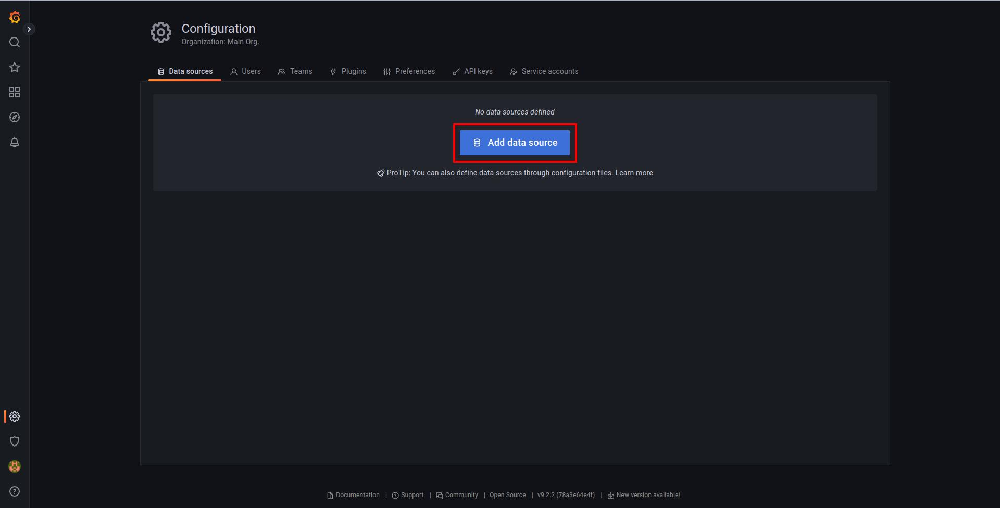
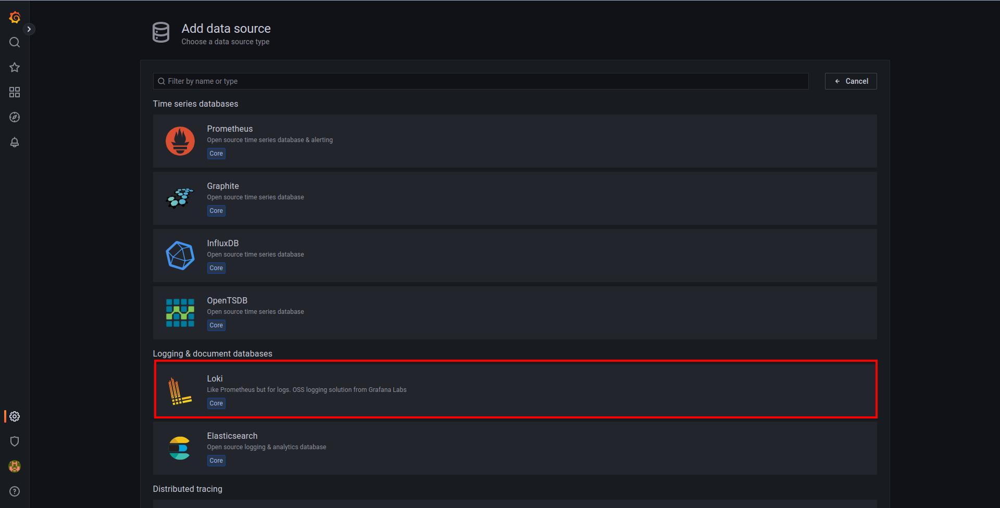
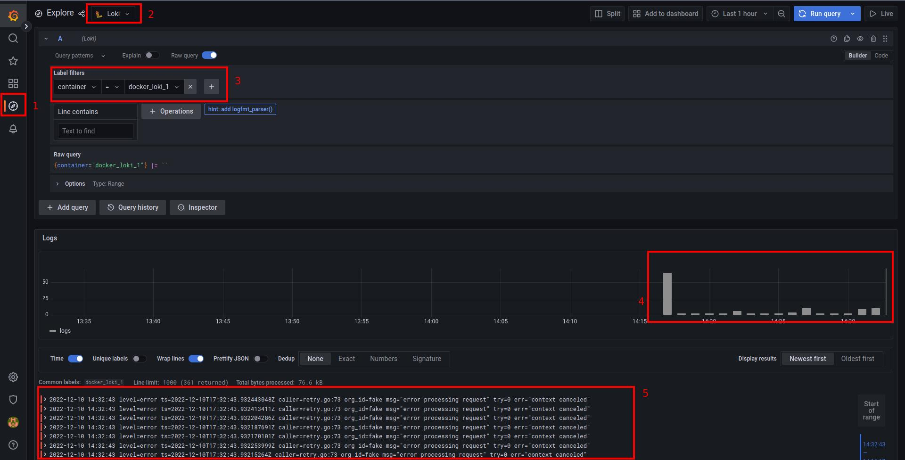

# Instalando o Loki no kubernetes
A ideia desse artigo é realizarmos a configuração do datasource do loki no grafana

# Pré Requisitos
Certifique-se de ter o grafana instalado e funcionando.

Se não tive aqui uma colinha!

- [Grafana](https://github.com/caiomarcatti12/grafana)

# Vamos a configuração

- Quando acessamos o grafana, ele nos mostra a imagem abaixo.
Se for a primeira vez que esta acessando o grafana o login padrão é "admin" e senha "admin".

- Para encontrar o menu de datasources, busque o ícone de engrenagem do lado esquerdo inferior e clique no menu "Data Source"
  

- Essa é a tela de fontes do grafana.Vamos clicar no botão "Add data source".

- Nessa tela serão listados todos as fontes possíveis de dados que o grafana pode trabalhar, aqui selecionamos Loki.

- Agora vamos preencher com as informações do nosso Loki, a primeira informação que precisamos preencher é o nome do Data Source, vamos colocar Loki (1).

    Depois vamos preencher a URL do Loki, que no nosso caso é http://loki:3100. (2)

    **Atenção nesse ponto porque dependendo de como você instalou o loki a url pode mudar**

    Por agora, não vamos adicionar nenhuma informação extra, como por exemplo tipos de autenticação, alertas, etc.

    Agora é clicar no botão "Save & Test" (3) para salvar as configurações e testar a conexão com o Loki

    Se tudo der certo será mostrado uma mensagem que foi adicionado com sucesso. (4)

- Bom por fim para saber se tudo ocorreu bem até aqui, vamos voltar no menu lateral esquerdo e clicar no ícone de "bussola".

    **Aqui é sua caixinha de areia e poderá brincar a vontade.**

    Na parte superior (2) selecione o data source "Loki" que acabamos de adicionar

    Logo abaixo se você tiver instalado a versão mais recente do grafana, você terá o query builder (3), nele podemos selecionar um dos labels capturados pelo loki e um valor disponivel

    Em nosso caso selecionamos a label "container" e o valor "docker_loki_1".

    **Essa label esta diponivel pois subimos o loki no docker com auto discovery**

    Mais em baixo podemos já visualizar a quantidade de logs capturados (4).

    E na parte mais profunda do print (5) os logs capturados.

Chega por hoje! Acho que já temos bastante conteúdo...